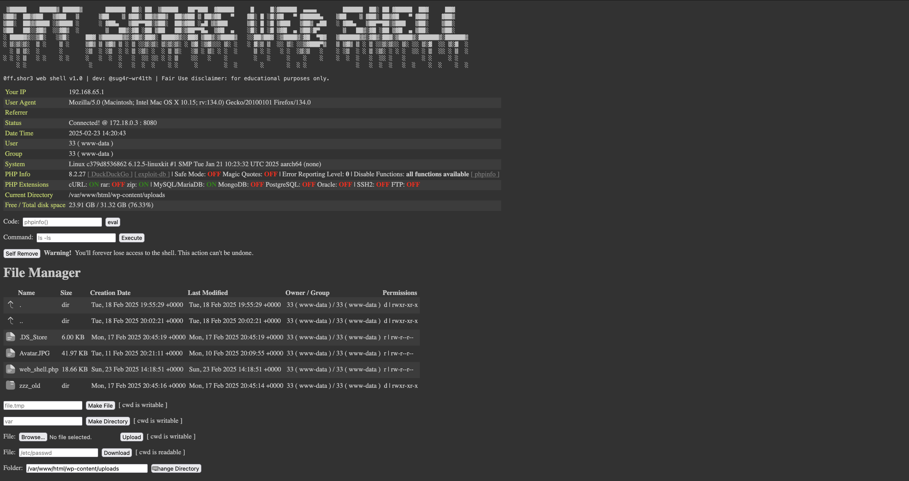

# 0ff.shor3-web-shell

A simple yet effective PHP web shell written in plain PHP and HTML/CSS/JavaScript.

# Features

- HTTP user agent authentication + decoy
- system info
- PHP installation info
- PHP eval + shell command execute
- self remove
- file manager

# How-to Use

- set `$use_auth` to `TRUE`
- set `$pwd` to value of choice
- upload to web server or use `<?php eval(...); ?>`
- own :)

# Disclaimer

Fair Use disclaimer: for educational purposes only.